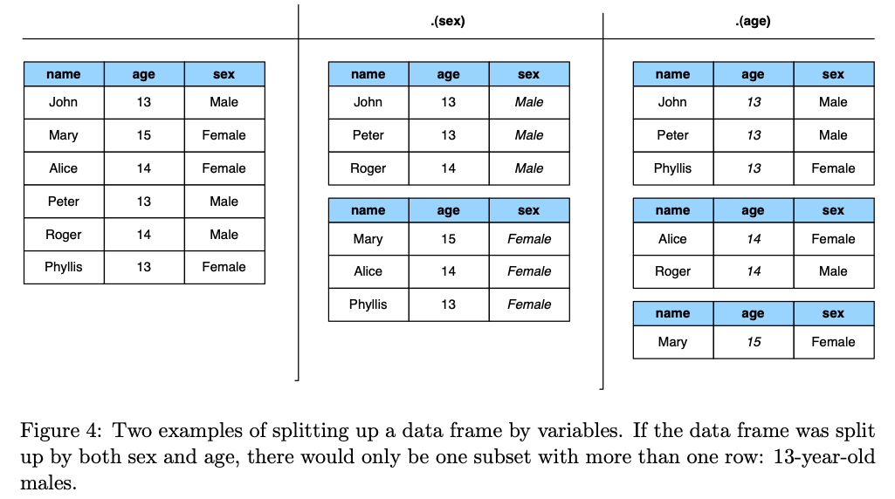
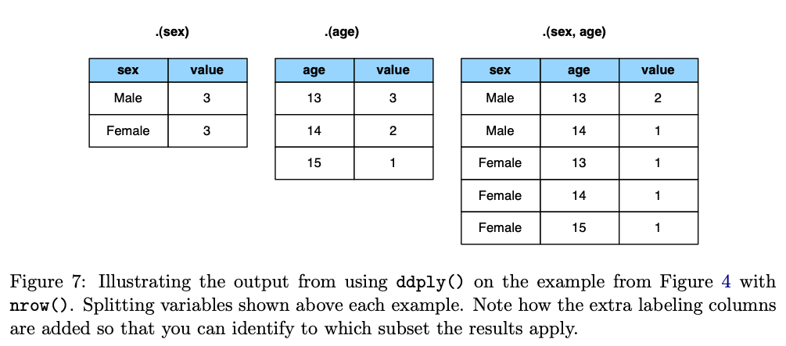
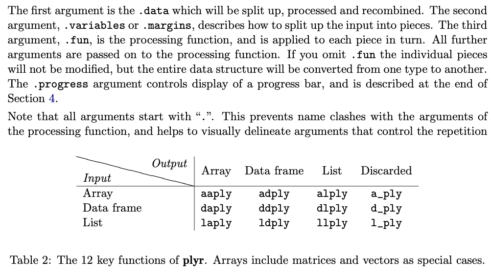
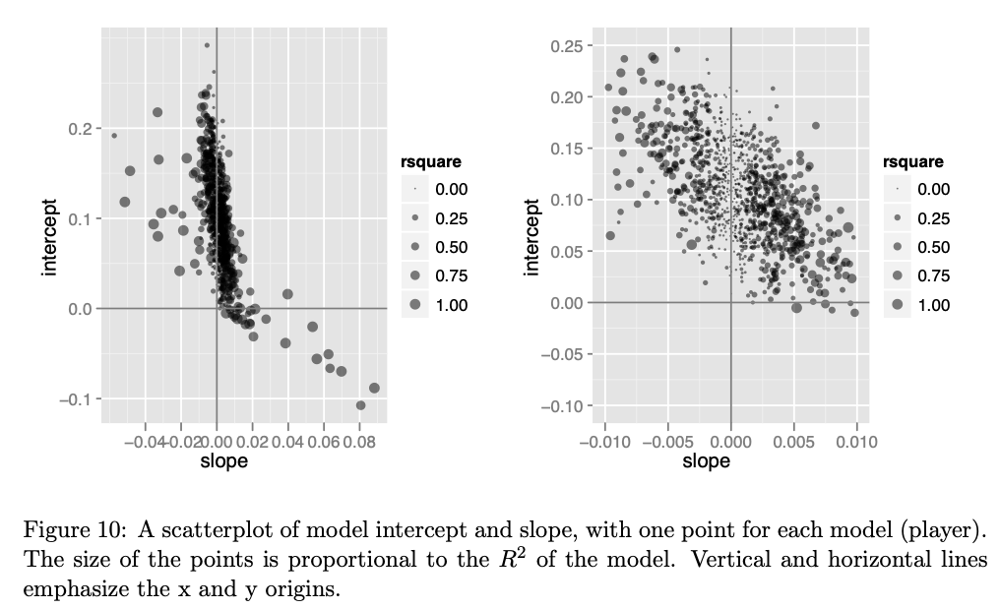
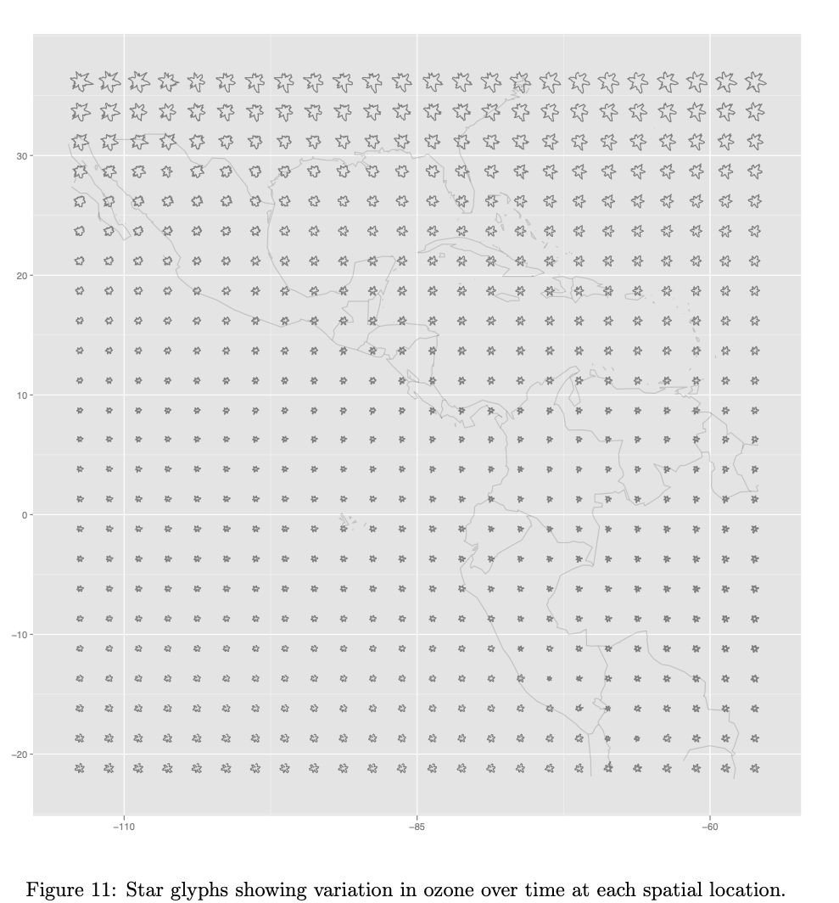

```{r, include = FALSE}
#| label: libraries
library(ggplot2)
library(tidyr)
library(dplyr)
library(readr)
library(stringr)
library(forcats)
library(colorspace)
library(patchwork)
library(conflicted)
conflicts_prefer(dplyr::filter)
conflicts_prefer(dplyr::select)
conflicts_prefer(dplyr::slice)
conflicts_prefer(dplyr::rename)
conflicts_prefer(dplyr::mutate)
conflicts_prefer(dplyr::summarise)
```

```{r, include = FALSE}
#| label: options-for-nice-slides
options(width = 200)
knitr::opts_chunk$set(
  fig.width = 5,
  fig.height = 5,
  fig.align = "center",
  dev.args = list(bg = 'transparent'),
  out.width = "100%",
  fig.retina = 5,
  dpi = 150, 
  echo = TRUE,
  warning = FALSE,
  message = FALSE,
  cache = FALSE
)
```

```{r, include = FALSE}
#| label: theme-for-nice-plots
theme_set(ggthemes::theme_gdocs() + #base_size = 14) +
  theme(plot.background = 
        element_rect(fill = 'transparent', colour = NA),
        #axis.line.x = element_line(color = "black", 
        #                           linewidth = 0.4),
        #axis.line.y = element_line(color = "black", 
        #                           linewidth = 0.4),
        panel.grid.major = element_line(color = "grey90"),
        axis.ticks = element_line(color = "black"),
        #plot.title.position = "plot",
        #plot.title = element_text(size = 14),
        panel.background  = 
          element_rect(fill = 'transparent', colour = "black"),
        legend.background = 
          element_rect(fill = 'transparent', colour = NA),
        legend.key        = 
          element_rect(fill = 'transparent', colour = NA)
  ) 
)
```


## Welcome 👋🏼 

:::: {.columns}
::: {.column width="45%"}

Thanks for joining to 

::: {style="font-size: 80%;"}

🦘 **[Di](https://www.dicook.org)** is a *Professor of Statistics*. She has more than 30 years of research and teaching of data visualisation, and open-source software development. She has published more than 10 papers on software. <br>
🐨 **[Fonti](https://fontikar.github.io)** is a *lecturer in Data Analytics and Statistics*. She has a background in evolutionary ecology, biology and open-source tool building, and is passionate in the learning new skills in R/Quarto and sharing it with others. <br>

*We are both in Econometrics and Business Statistics, at Monash University.* 

:::

<br>

::: {.fragment}

🧩 Feel free to ask questions any time. 🤔

:::


:::
::: {.column width="5%"}

:::
::: {.column width="45%"}

::: {.fragment}

::: {style="font-size: 80%;"}
<br>

🎯 The objectives for today are to:

- be able list several outlets available for publishing software
- understand the benefits of publishing a software paper
- identify the components of a well-constructed software article
- draft an paper on your own software

:::
:::


:::
::::


# Session 1  {.transition-slide .center-align}

# Why publish software as an article? {.transition-slide style="align: center;"}

## What is a software article?

It is an academic publication whose primary subject is a piece of software. Instead of reporting a scientific finding, the paper typically describes: 

- **What the software does**: the problem it solves and how it fits into the existing landscape of tools.
- **How it works**: the underlying methods, algorithms, or statistical models it implements.
- **How to use it**: installation, basic API/interface, and often a worked example or application.
- **Why it matters**: the gap it fills, who the intended users are, and how it differs from alternatives.
- **Availability**: where the code lives (e.g., CRAN, GitHub), license, and how to cite it.

## Benefits to the community

::: {.f70}

1. **Discoverability**

A GitHub repo or CRAN listing is easy to miss unless someone already knows to look for it. A paper in an indexed journal (Web of Science, Scopus, Google Scholar) surfaces the tool to people searching the literature by topic or method, not by package name.

2. **Peer-reviewed vetting of methodology**

Code review (via CRAN checks or GitHub CI) verifies the software runs. It doesn't verify that the statistical or computational methods behind it are sound. Peer review of a software paper adds a layer of scrutiny on the actual science.

3. **Structured comparison to alternatives**

Because papers are expected to situate the tool relative to existing options, they often produce the clearest available account of the landscape of similar tools.

4. **Faster adoption and trust**

A peer-reviewed paper signals a baseline of quality and rigor to potential users who are deciding whether to build their analysis pipeline around a new tool.

5. **Documentation that outlives the maintainer**

Vignettes and READMEs get out of date or vanish if a repo is abandoned. A published paper is archived independently (by the journal, DOI, sometimes in institutional repositories) and remains a stable description of the tool's design and rationale even if the software itself evolves or stops being maintained.

:::

## Why not publish just as supplementary material?

A standalone software paper is discoverable and citable in ways supplementary material isn't: search engines and citation databases index main articles, not S1 files, so a tool described only as a supplement to an unrelated study is nearly invisible to someone searching for a general-purpose method, and there's no clean way to cite it without citing the whole host paper. Supplementary material also gets far less rigorous review, while a dedicated paper subjects the software to real scrutiny and gives it proper room for design rationale, comparisons, and examples. It decouples the tool from any one study's lifecycle, framing it as reusable infrastructure that can be updated over time, and it converts the effort of building it into a distinct, indexed scholarly output, which matters for the career incentives of whoever's real contribution was the software itself.

## Common outlets

::: {.panel-tabset}

## Outlets

- [Journal of Statistical Software](https://www.jstatsoft.org/index)
- [The R Journal](https://journal.r-project.org)
- [Journal of Open Source Software](https://joss.theoj.org)

Many domain-specific journals have a software section, for example:

- [Genome Biology](https://link.springer.com/journal/13059/volumes-and-issues/27-1)
- [Methods of Ecology and Evolution](https://besjournals.onlinelibrary.wiley.com/toc/2041210x/current) 
- [Royal Society
Open Science](https://royalsocietypublishing.org/rsos)
- [Applications in Plant Sciences](https://bsapubs.onlinelibrary.wiley.com/journal/21680450)

## Comparison

::: {style="font-size: 70%"}

| Criterion         | JSS                        | The R Journal              | JOSS                           |
|--------------------|----------------------------|------------------------------|---------------------------------|
| Scope              | Any statistical software  | R only                      | Any research software          |
| Length             | Long (full paper)         | Medium-long                     | Very short                     |
| Review focus       | Methodology + code        | Package quality + writeup   | Codebase (tests, docs, license) |
| Output format      | PDF only                  | Native HTML (+ PDF)         | PDF (via Markdown/GitHub)      |
| Interactive figures| Not supported             | Supported (native HTML)     | Not part of the paper itself   |
| Impact factor      | High               | Moderate, variable        | None by design                 |
| Time to publish    | Slower, thorough           | Moderate                    | Often fast if code is ready    |
| Best fit           | Novel/complex method       | Solid, R-specific package   | Working, well-engineered tool  |

:::

:::

## Your turn {.activity-slide}

Let's compare and contrast articles from these journals.

::: {.f70}

- JSS: [Wickham (2011) The Split-Apply-Combine Strategy for Data Analysis](https://www.jstatsoft.org/article/view/v040i01)
- R Journal: [Ayala eet al (2023) asteRisk - Integration and Analysis of Satellite Positional Data in R](https://journal.r-project.org/articles/RJ-2023-023/)
- JOSS: [Graesser et al (2026) GeoWombat: Scalable geospatial and remote sensing analysis in Python](https://joss.theoj.org/papers/10.21105/joss.10812)
- Genome Biology: [Holt at al (2026) Aardvark: sifting through differences in a mound of variants](https://link.springer.com/article/10.1186/s13059-026-04165-0)

:::

Have a quick glance through each of these articles, and make some notes:

::: {.f60}

- How long is the article?
- Sketch the paper structure.
- Depth of details about the software.
- Are there any code fragments?
- Is there an application section?
- Is there a flow chart? 
- Are there figures? 
- What is the format of the article (PDF, HTML)?
- How many references?
- Is there a comparison with other software?
- Does it provide links to the package source?
- Is there an overview of how the software is organised?
- Are there supplementary material, e.g. code and data?
- Anything else that is interesting to note about the article. <!-- JOSS has open review! -->

:::

`r countdown::countdown(10, 21)`

# What goes into an article about software? {.transition-slide style="align: center;"}

## Problem statement and motivation

Why did you write the software? What is special and why others should use it? Why existing tools don't do the job? Putting your work in the context of existing software. 

::: {.panel-tabset}

## JSS

> What do we do when we analyze data? What are common actions and what are common mistakes? Given the importance of this activity in statistics, there is remarkably little research on how data analysis happens. This paper attempts to remedy a very small part of that lack by describing one common data analysis pattern: Split-apply-combine. 

## RJ

::: {.f80}

> Since the launch of Sputnik 1 in 1957, the developments in space technology have enabled a fast growth of the amount of satellites placed in orbit around Earth. Such growth has become especially prominent in the last decade, as evidenced by the fact that over a third of the 11,697 satellite launches performed until September 2021 occurred over the last 5 years (United Nations). The number of organizations behind satellite launches has also considerably expanded, and currently includes not only government and military agencies, but also private entities. This is largely due to technological developments, such as miniaturized satellites, that have made the process of placing a satellite on orbit around Earth increasingly accessible (Toorian et al. 2008; Bouwmeester and Guo 2010; Kirillin et al. 2015).

:::

## JOSS

::: {.f80}

> Satellite remote sensing has become essential for environmental monitoring, agriculture, disastervmanagement, and land use analysis. Modern sensor constellations such as Sentinel-2, Landsat, and PlanetScope produce petabytes of freely available imagery, yet the Python ecosystem for
processing this data remains fragmented. A typical analysis workflow requires stitching together multiple libraries: rasterio for I/O, GDAL (GDAL/OGR contributors, 2024) for warping, NumPy (Harris et al., 2020) for array math, xarray for labeled dimensions, geopandas (Jordahl et
al., 2020) for vector operations, and scikit-learn for modeling, each with its own conventions for handling coordinate reference systems, nodata values, affine transforms, and chunked computation.

:::

## Genome Biology

::: {.f80}

> Precise genomic variant comparison is fundamental to improving sequencing technologies and ensuring accurate variant calling for research and clinical applications. Therefore, it is critical that variant comparison tools, also known as benchmarking tools, provide the best means to identify real differences between variant call sets by minimizing the representation issues that persist across technology platforms and variant calling software. While sequencing technologies have advanced, there has not been much active development on variant benchmarking tools because they require a great deal of care to properly implement and are often viewed as a resource rather than scientific advancement. As technologies improve, the fraction of false positive/negative variants will shift from true addressable errors to benchmarking issues, slowing the pace of technological improvement. This justifies a renewed effort to improve variant comparison tools, as well as the genomic truthsets they rely on.

:::

:::

## Key features of the software

::: {.panel-tabset}

## JSS

Very clear: Re-organising and summarising data, shown using tables and illustrations.

:::: {.columns}
::: {.column}

:::
::: {.column}

:::
::::

## RJ

## JOSS

## Genome Biology

:::

## Design/implementation details

::: {.panel-tabset}

## JSS

The paper does not have any design and implementation details. It is very user-facing, providing motivation and how to use it. At most, it explains the conceptualisation that makes usage easier: 

{width=600}

## RJ

## JOSS

## Genome Biology

:::

## Examples/use cases/applications/speed comparisons/benchmarking

::: {.panel-tabset}

## JSS

Two worked examples, that illustrate reasonably complex data processing.

:::: {.columns}
::: {.column}

Baseball statistics


:::
::: {.column}

Spatiotemporal patterns in ozone

{width=400}

:::
::::

## RJ

## JOSS

## Genome Biology

:::

## End of session 1 {.center}

<a rel="license" href="http://creativecommons.org/licenses/by-sa/4.0/"></a><br />This work is licensed under a <a rel="license" href="http://creativecommons.org/licenses/by-sa/4.0/">Creative Commons Attribution-ShareAlike 4.0 International License</a>.

